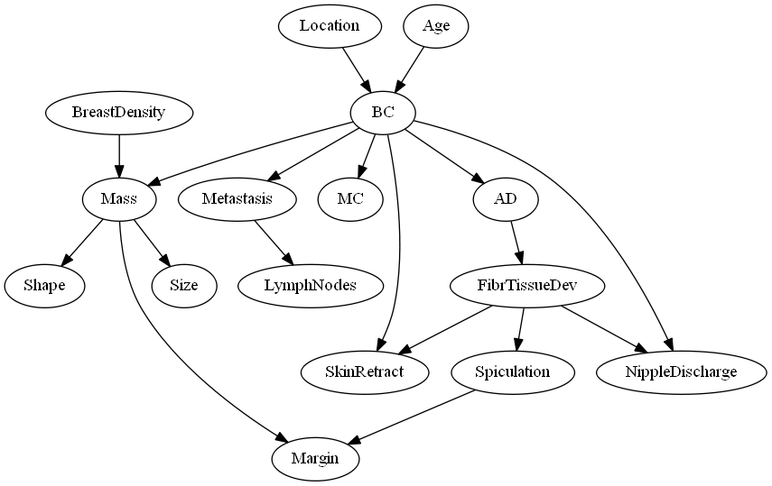
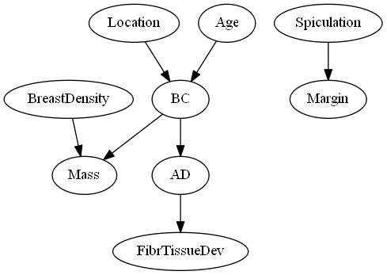
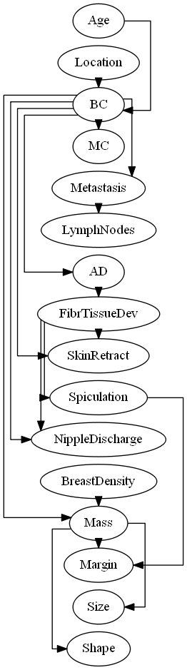
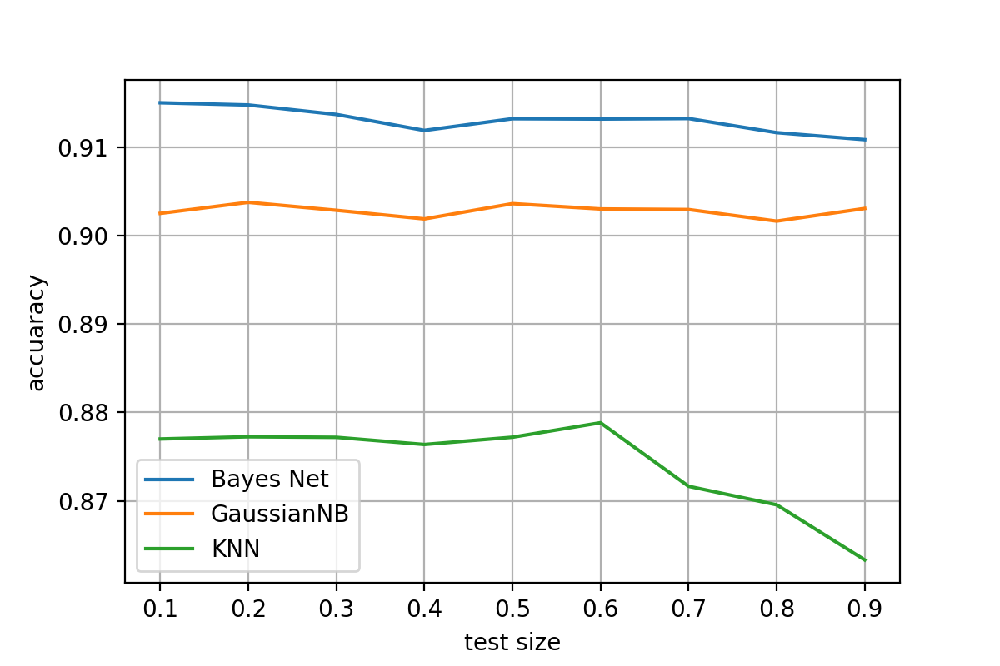

# Use bayes net to detect breast cancer.

*Written by filrLi@github, please cite if you use.*

The data set used in this project is `bc 2.csv`

---

# Task 1 – Efficient d-separation test

## Main challenges

- **Prune the graph**

    Actually this is not very difficult, I just followed the d-separation algorithm and it went well.

- **Visualize the process**

    The bothering part is to visualize the process.

    I spent quit a lot of time to figure out how to use the library Grphviz, but I think it is worth it because it makes the problem clearer.

    Here as you can see, if we want to check whether {'Location'}, {'Margin'} is d-separable given {'FibrTissueDev', 'Mass'}

    The original graph will be pruned to the graph below it.

From the pruned graph, we can see that 'Location' is not connected with 'Margin', so they are d-separated given 'FibrTissueDev' and 'Mass'.

Original Bayes Net

Pruned Graph

## Time complexity analysis

1. Pruning the graph cost *O(n^2)*
2. Checking whether two node are connected cost *O(n)* , check whether two sets of nodes are disconnected cost *O(n^2)*

So total cost is *O(n^2)*

---

# Task 2 – Estimate Bayesian Network parameters from data

## Main challenges

- **Smoothing**

    I didn't use smoothing at the very beginning, but when it came to estimate the conditional distribution for each node, I need to use this math equation: 

    $$P(node|parents) = \frac{P(node, \space parents)}{\sum_{node}P(parents|node)P(node)}$$

    In some situation *P(node, parents)* might be 0, which means for some specific combination of *parents,* there is no such record in the data. Than both numerator and denominator become 0, which would be a disaster.

    So I have to use smoothing, pretending there is at least one record for each combination, presented by the following equation:

    $$P(node|parents) = \frac{P(node, \space parents) +1}{\sum_{node}(P(parents|node)P(node)+1)}$$

Other things in this task are relatively easy because most functions are already implemented in tutorials.

## Questions

> We are working with a small Bayesian Network with 16 nodes. What will be the size of the joint distribution with all 16 variables?

**Answer:**

- *The size of the joint distribution depends on the size of domain of each variable, which is 2654208.*

$$size(joint\space distribution) = \prod_{variable}|variable|$$

---

# Task 3 – Sampling

## Main challenges

- **Topological sort**

    To sample from the bayes network, first we need to topologically sort the graph, then based on the topological order, assign the value to each node in the network.

    The picture on the right shows the topological order of the bayes net.

    The specific algorithm and implementation can be found in the `Assignment1.ipynb`

- **Sampling**

    Within the topological order, assign values to each node by using the condition distribution table created in the task 2.

    For example, 'Age' and 'Location' are parents of 'BC', given the values of 'Age' and 'Location' we can pick a value for 'BC' according to *P(BC | Age, Location).*

    The new-generated 1000 samples will be stored in `1000samples.csv` after running the code cell.

## Time complexity analysis

1. Topological sort is actually based on DFS, so the cost is *O(n)*
2. Sampling cost *O(n)*

So the total time complexity is *O(n).*

## Questions

> What happens as you add more observed variables in the query in terms of accuracy and effective sample size?

**Answer:** 

- *As I add more observed variables in the query, the size of effective samples will shrink because the evidences observed narrow the outcome space and the output will be more accurate.*

---

# Task 4 – Classification

## Main challenges

- **Turn all text value into integers**

    Because the model in the sklearn library doesn't support string type variables, so I implement a function to convert all the variables.

- **Compute the join distribution**

    The method used for classification is actually maximum likelihood.

    The hard part is to compute the joint distribution according to given evidence X. More specific implementation can be found in `Assignment1.ipynb`

- **Compare with other classification models**

    Here I choose Gaussian Naive Bayes and K-nearest neighbor as comparisons.

    The result is shown at the right side.

    From the result, we can see that our Bayes net is a little better than Gaussian Naive Bayes and KNN models. And the test size doesn't affect the performance of Bayes Net and GaussianNB very much.

